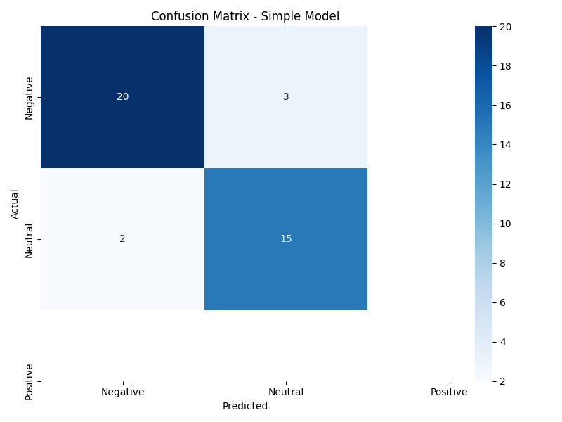
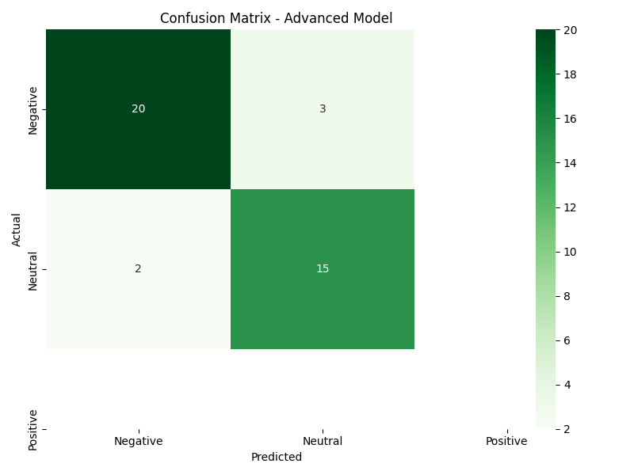
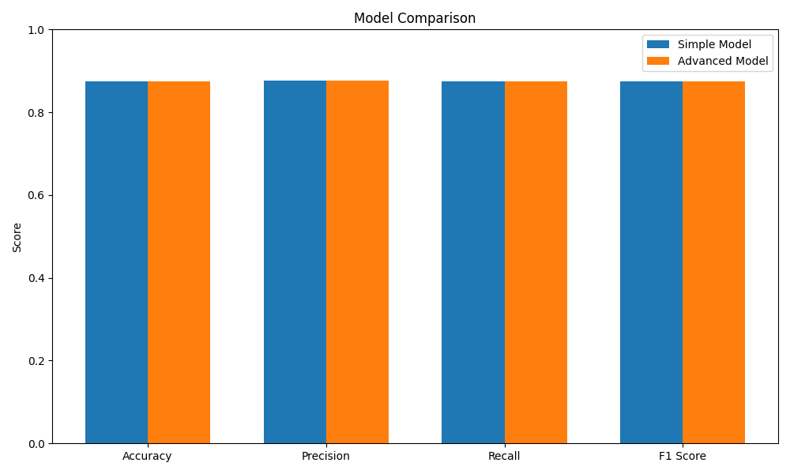

<h1 align="center">NLP TDD - Sentiment Analysis</h1>
<h3 align="center"><i>(M2PEX_ML_TDD2_python)</i></h3>

<p align="center">
  <p align="center">
    A Flask-based sentiment analysis API for Twitter/X posts using machine learning.
  </p>
    <p align="center">
        <a href="https://github.com/hugo-HDSF/M2PEX_ML_TDD2_python/issues">Report Bug</a>
        .
        
    </p>
</p>

<div align="center">


</div>

-----

## Project Overview

SocialMetrics AI provides sentiment analysis for Twitter/X posts for social media opinion monitoring. The system
evaluates tweet sentiment on a scale from -1 (very negative) to 1 (very
positive) using a logistic regression machine learning model.

### Key Features:

1. **REST API Endpoint** - Analyze sentiment of multiple tweets in one request
2. **MySQL Database** - Store annotated tweets for continuous model improvement
3. **Machine Learning Models** - Two models: Simple Logistic Regression and Advanced NLP with Lemmatization & Stemming
4. **Model Comparison** - Performance metrics and visual comparison between models
5. **Automated Retraining** - Weekly cron job to retrain with the latest data
6. **Performance Metrics** - Confusion matrices and evaluation metrics for model assessment

## Installation & Setup

### With Docker (Recommended):

```Shell
git clone https://github.com/hugo-HDSF/M2PEX_ML_TDD2_python.git
cd M2PEX_ML_TDD2_python
make install
```

The application will be available at http://localhost:5001

## API Usage

### Sentiment Analysis

**Endpoint:** `POST /api/analyze`

**Request body:**

```json
{
"tweets": [
"J'aime beaucoup ce produit, il est formidable!",
"C'est la pire expérience de ma vie, je suis très déçu."
],
"model_type": "simple"  // Optional: "simple" (default) or "advanced"
}
```

**Response:**

```json
{
"J'aime beaucoup ce produit, il est formidable!": 1.0,
"C'est la pire expérience de ma vie, je suis très déçu.": -1.0
}
```

### Example with curl:

```Shell
curl -X POST http://localhost:5001/api/analyze \
-H "Content-Type: application/json" \
-d '{"tweets": ["J'\''aime beaucoup ce produit!", "Ce service est horrible."], "model_type": "simple"}'
```

## Model Architecture

The sentiment analysis system offers two different models:

1. **ML Regression Model**
   - Uses text preprocessing (cleaning and stopword removal)
   - TF-IDF vectorization with 1000 features
   - Single logistic regression model with 80/20 train/test split
   - Classifies sentiment as positive (1), neutral (0), or negative (-1)

2. **Advanced NLP Regression Model**
   - Uses text preprocessing (cleaning and stopword removal)
   - Additional lemmatization and stemming steps
   - TF-IDF vectorization with 1000 features
   - Single logistic regression model with 80/20 train/test split
   - Potentially better at handling text variations and morphological differences

### Text Processing Pipeline:

1. Clean text by removing special characters
2. Remove stopwords using NLTK's French stopword list
3. For advanced model: Apply lemmatization and stemming
4. Convert text to TF-IDF features using scikit-learn
5. Apply the trained logistic regression model to predict sentiment score

## Database Structure

The MySQL database contains a `tweets` table with the following structure:

| Column     | Type      | Description                            |
|------------|-----------|----------------------------------------|
| id         | INT       | Primary key, auto-increment            |
| text       | TEXT      | Content of the tweet                   |
| positive   | BOOLEAN   | 1 if tweet is positive, 0 otherwise    |
| negative   | BOOLEAN   | 1 if tweet is negative, 0 otherwise    |
| created_at | TIMESTAMP | When the tweet was added to the system |

## Automated Retraining

The models automatically retrain weekly using a cron job that:

1. Retrieves all the tweets from the database
2. Processes and prepares the data for training (80/20)
3. Trains both the simple and advanced models
4. Generates performance metrics, confusion matrices and comparison charts
5. Saves the updated models for future predictions

## Evaluation Metrics

The system generates confusion matrices, comparison charts, and performance metrics after each
training:

<table>
  <tr>
    <td>
      
    </td>
    <td>
      
    </td>
  </tr>
</table>



Current model performance:

```json
{
"simple_model": {
"accuracy": 0.85,
"precision": 0.87,
"recall": 0.85,
"f1": 0.86
},
"advanced_model": {
"accuracy": 0.90,
"precision": 0.91,
"recall": 0.90,
"f1": 0.90
},
"last_trained": "2025-03-28 16:45:23"
}
```

## Model Comparison Reports

For a comprehensive analysis of both models' performance, including detailed
metrics, confusion matrices, and improvement recommendations, please see
the [Evaluation Report](app/static/model_evaluation.pdf).

## Project Structure

```Shell
├── app/
│ ├── __init__.py # Flask application initialization
│ ├── api # API endpoints
│ ├── static/ # Static files including model files and visualizations
│ ├── database/ # Database models and repositories
│ ├── model/ # Sentiment analysis model implementations
│ ├── scripts/ # Scripts for data initialization
│ └── templates/ # HTML templates for web interface
├── .env.exemple # Environment variables
├── config.py # Configuration file for Flask and database
├── docker-compose.yml # Docker services setup
├── Dockerfile # Docker configuration
├── init_cron.sh # Cron job setup for automated retraining
├── Makefile # Make commands for easy setup
├── requirements.txt # Python dependencies
├── run.py # Application entry point
├── setup.py # Setup script for command line interface
└── wait-for-db.sh # Wait for MySQL to be ready
```

> [!NOTE]
> The models require at least 10 annotated tweets to begin training. Initial
> predictions may be less accurate until sufficient training data is available.

> [!TIP]
> For best results, try both models and compare their performance on your specific data.
> The advanced model may perform better on complex texts, while the simple model
> might be faster for large volumes of data.

### groupe:
- DA SILVA Hugo
- CAPOLUNGHI Romain
- DHIVERT Maxime
- ANGO Shalom